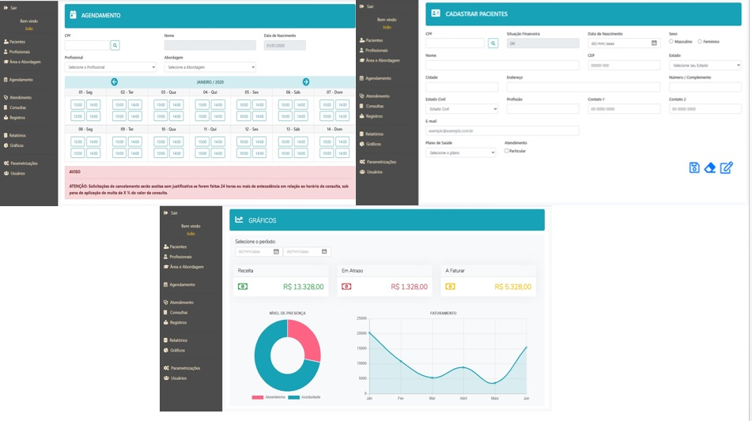

# PSystem

PSystem é uma proposta para gerenciamento de clínicas e consultórios particulares na área de psicologia com simplicidade e eficiência.

O projeto é resultado de um desafio proposto na disciplina de Engenharia de Software no curso de Análise e Desenvolvimento de Sistemas na parceria ente a FATEC Rubens Lara e a Oracle.

Após entrevistas com profissionais da área identificamos dores comuns: agenda e finanças.

Com base nas dificuldades idealizamos um sistema web utilizando as seguintes tecnologias e bibliotecas:
* HTML5
* CSS3
* Javascript
* Jquery
* Bootstrap

O projeto conta com cadastro de pacientes e profissionais, agendamento de consultas, registro médico, relatório de agenda e finanças.

Seu diferencial será permitir que o próprio paciente possa agendar sua consulta reduzindo o gargalo administrativo, agilizando a comunicação e reduzindo o absenteísmo das consultas.

Permitirá parametrizações para definição de agenda, método de pagamento, cobrança de multas e área de atuação dos profissionais.

Proposta futura:
* Desenvolvimento back-end
* Integração com API para notificação após agendamento ou cancelamento de consultas
